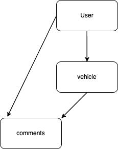

# project-2-Jaden-Ruplal

Like the previous project this one will be vehicle related. Using the NHTSA APi there will be a main page where you can select different options:

1. user signs up for the first time or signs in
2. create specific vehicles they want or have currently using set Schema
3. comment anything on the vehicles they have
4. user can comment on other vehicles which other users can see

API:

1. https://vpic.nhtsa.dot.gov/api/
2. https://www.vinaudit.com/api-subscribers?gclid=Cj0KCQjwlK-WBhDjARIsAO2sErQkHMrSnAlEGrMV2eOljzs2_OI229jmOMALDIa4vIkRVeOrlfp_-uIaAhKPEALw_wcB

Routes:

| path                                 | verb   | description                                         |
| ------------------------------------ | ------ | --------------------------------------------------- |
| /signup                              | post   | user sign up                                        |
| ----                                 | ----   | ----                                                |
| /signin                              | post   | user sign in                                        |
| ----                                 | ----   | ----                                                |
| /signup/passwordChange               | update | user changes password                               |
| ----                                 | ----   | ----                                                |
| /vehicleList                         | get    | search through vehicles to add to your vehicle list |
| ----                                 | ----   | ----                                                |
| /vehicles                            | post   | add vehicles you like or wish to have               |
| ----                                 | ----   | ----                                                |
| /vehicles/vehicleID                  | update | edite vehicles you already have picked out          |
| ----                                 | ----   | ----                                                |
| /vehicles/vehicleID                  | delete | delete vehicles you already have picked out         |
| ----                                 | ----   | ----                                                |
| /vehicles/vehicleID/comments         | post   | post comments on a vehicle                          |
| ----                                 | ----   | ----                                                |
| /vehicles/vehicleID/comments/comment | update | update comments on a vehicle                        |
| ----                                 | ----   | ----                                                |
| /vehicles/vehicleID/comments/comment | delete | delete comments on a vehicle                        |
| ----                                 | ----   | ----                                                |

Models:
user - holds user name and password
comments - hold comments made on anything from companies to specific vehicles
savedVehicles - stores all vehicles saved by specific user

Wireframe:

